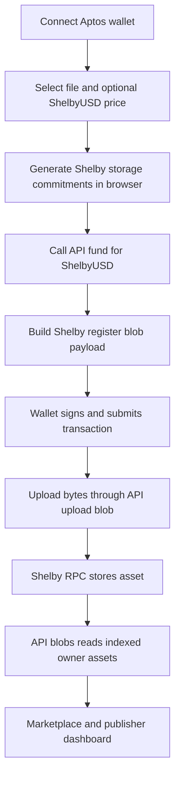

<div align="center">

# Shelby Marketplace

**A polished Shelbynet marketplace for publishing, pricing, discovering, and accessing wallet-gated data assets.**

[](https://skillicons.dev)


[Live Demo](https://shelby-marketplace-livid.vercel.app/) · [Browse Catalog](#features) · [Upload Flow](#how-it-works) · [Security](#security)

</div>

---

## Overview

Shelby Marketplace turns raw files and datasets into market-ready data assets. Publishers can connect an Aptos-compatible wallet, register a file on Shelby, attach optional ShelbyUSD pricing metadata, upload through a secure server proxy, and expose the asset inside a searchable marketplace catalog.

The app is built for the **Shelby testnet / Shelbynet** flow and keeps sensitive Shelby/Geomi API calls on the server side.

## Features

| Area | What it does |
| --- | --- |
| **Marketplace catalog** | Search assets, filter by category, filter free/paid assets, sort by popularity or price. |
| **Wallet publishing** | Connect wallet, select file, generate commitments, sign Shelby registration transaction. |
| **Server-side upload** | Upload file bytes through `/api/upload-blob` so API keys never enter the browser. |
| **Publisher dashboard** | Load wallet-owned published assets through a Shelby indexer server proxy. |
| **Pricing metadata** | Add ShelbyUSD listing price metadata for client review and future buyer flows. |
| **Premium UI** | Responsive Astro + React island interface with 3D-style hero, wallet modal styling, and mobile nav. |

## Tech Stack

[](https://skillicons.dev)

[](https://skillicons.dev)

- **Astro** — server-rendered routes and Vercel server adapter
- **React islands** — wallet UI, upload wizard, marketplace filters, animated nav
- **TypeScript** — typed app logic and SDK integrations
- **Aptos wallet adapter** — wallet connection and transaction signing
- **Shelby SDK** — blob registration, storage commitments, RPC upload, indexer reads
- **Framer Motion** — polished navigation and UI transitions
- **Vitest** — marketplace and monetization logic tests

## Routes

| Route | Purpose |
| --- | --- |
| `/` | Landing page and marketplace overview |
| `/browse` | Public marketplace catalog |
| `/upload` | Wallet-gated asset publishing flow |
| `/my-blobs` | Publisher dashboard for wallet-owned assets |
| `/blob/[address]/[filename]` | Public asset detail and access link |
| `/api/fund` | Server route to fund wallet with ShelbyUSD |
| `/api/upload-blob` | Server-side Shelby RPC upload proxy |
| `/api/blobs` | Server-side Shelby indexer proxy |

## How It Works



Browser code does **not** use `ShelbyClient.upload()` because wallet users never expose a full keypair. Instead, the app uses a manual wallet-safe Shelby flow:

1. Generate commitments from file bytes.
2. Fund/prepare the wallet account.
3. Build `ShelbyBlobClient.createRegisterBlobPayload()`.
4. Ask the wallet to sign and submit registration.
5. Upload file bytes through the secure server proxy.
6. Read indexed assets through the secure server proxy.

## Setup

```bash
npm install
cp .env.example .env
npm run dev
```

Fill `.env` with server-side keys:

```bash
GEOMI_API_KEY=
SHELBY_API_KEY=
PUBLIC_APTOS_NETWORK=shelbynet
PUBLIC_SHELBY_RPC_URL=https://api.shelbynet.shelby.xyz/shelby
PUBLIC_SHELBY_EXPLORER_URL=https://explorer.shelby.xyz/shelbynet
PUBLIC_SITE_URL=https://shelby-marketplace-livid.vercel.app
```

## Security

- Keep `GEOMI_API_KEY` and `SHELBY_API_KEY` server-side only.
- Never place secret keys in `PUBLIC_*` variables.
- `.env`, `.env.*`, `.vercel/`, `dist/`, and `node_modules/` are ignored by git.
- `.env.example` contains placeholders only.
- Shelby RPC/indexer calls that require API keys are routed through Astro API endpoints.

## Checks

```bash
npm test
npx astro check
npm run build
```

Current local verification:

```text
2 test files passed
6 tests passed
astro check: 0 errors
```

## Deploy

Configured for Vercel server output via `@astrojs/vercel` because API routes need server runtime.

```bash
npm run build
```

Then deploy to Vercel and set the same environment variables in the project dashboard.

## Project Status

This is a working Shelbynet marketplace prototype with upload-side registration and catalog UX. Buyer checkout / paid download settlement can be extended next with Shelby micropayment channel creation, off-chain micropayment signatures, and protected `getBlob({ micropayment })` retrieval.
